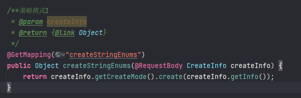
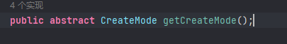
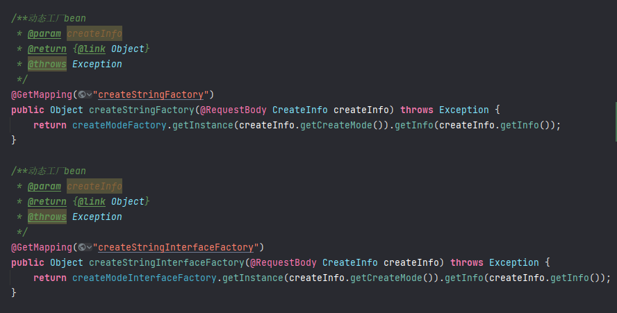

# 有关于优化业务解耦的设计模式
## 1.枚举抽象（简单业务实现）
业务存在不同枚举值对应不同的赋值操作，可以定义一个赋值操作的顶层接口  
[Create.java](src%2Fmain%2Fjava%2Forg%2Fsuki%2Fdesign%2Fmode%2Finterfaces%2FCreate.java)  
不同枚举值实现自己的方法  
[CreateMode.java](src%2Fmain%2Fjava%2Forg%2Fsuki%2Fdesign%2Fmode%2Fenums%2FCreateMode.java)  
将枚举类作为对象封装在传入参数中  
[CreateInfo.java](src%2Fmain%2Fjava%2Forg%2Fsuki%2Fdesign%2Fmode%2Fdomain%2FCreateInfo.java)  
定义此类枚举的顶层接口，@JsonValue用于前端入参的序列化  
[IEnumType.java](src%2Fmain%2Fjava%2Forg%2Fsuki%2Fdesign%2Fmode%2Finterfaces%2FIEnumType.java)  
请求结构体会通过对应的枚举值调用自己Override的方法    
  
如果使用mybatis作为jdbc框架，建议配置mybatis的枚举序列化器
## 2.抽象类多继承（复杂业务实现）
业务存在不同枚举值对应不同的操作，首先定义枚举类  
[CreateMode.java](src%2Fmain%2Fjava%2Forg%2Fsuki%2Fdesign%2Fmode%2Fenums%2FCreateMode.java)  
定义顶层抽象类，封装公共方法，定义抽象方法，定义抽象类的key  
[GenericCreate.java](src%2Fmain%2Fjava%2Forg%2Fsuki%2Fdesign%2Fmode%2Fhandler%2Fabstracts%2FGenericCreate.java)  
抽象类的多实现  
[DirectInfo.java](src%2Fmain%2Fjava%2Forg%2Fsuki%2Fdesign%2Fmode%2Fhandler%2Fdynamic%2FDirectInfo.java)  
[FactoryInfo.java](src%2Fmain%2Fjava%2Forg%2Fsuki%2Fdesign%2Fmode%2Fhandler%2Fdynamic%2FFactoryInfo.java)  
[FunctionalInfo.java](src%2Fmain%2Fjava%2Forg%2Fsuki%2Fdesign%2Fmode%2Fhandler%2Fdynamic%2FFunctionalInfo.java)  
[ReflectInfo.java](src%2Fmain%2Fjava%2Forg%2Fsuki%2Fdesign%2Fmode%2Fhandler%2Fdynamic%2FReflectInfo.java)  
为什么返回枚举常量  
  
将这些多实现类的对象放入map集合里。
实现InitializingBean, DisposableBean 接口，加载交由springboot接管。
map里存在唯一kv对应（也是通过对应枚举值寻找对应实现类并调用对应方法，参考 HANDLER_COMPONENT_MAP）  
Function<T,R> 函数式调用 可以使代码更简略（参考 HANDLER_MAP）  
[GenericContext.java](src%2Fmain%2Fjava%2Forg%2Fsuki%2Fdesign%2Fmode%2Fcontext%2FGenericContext.java)
## 3.动态加载（不推荐）
FactoryBean是springboot提供的一个动态实例化bean的一个接口，这是一个对通用接口的代理封装  
[CurrencyFactoryBean.java](src%2Fmain%2Fjava%2Forg%2Fsuki%2Fdesign%2Fmode%2Fcurrent%2FCurrencyFactoryBean.java)  
提供注解，用于继承同一接口的多实现类，注意：这些实现类上没有@Component注解  
[FactoryBeanCreate.java](src%2Fmain%2Fjava%2Forg%2Fsuki%2Fdesign%2Fmode%2Fanno%2FFactoryBeanCreate.java)  
顶层接口  
[Info.java](src%2Fmain%2Fjava%2Forg%2Fsuki%2Fdesign%2Fmode%2Finterfaces%2FInfo.java)  
接口类的实现  
[DirectInfo.java](src%2Fmain%2Fjava%2Forg%2Fsuki%2Fdesign%2Fmode%2Fhandler%2Fdynamic%2FDirectInfo.java)  
[FactoryInfo.java](src%2Fmain%2Fjava%2Forg%2Fsuki%2Fdesign%2Fmode%2Fhandler%2Fdynamic%2FFactoryInfo.java)  
[FunctionalInfo.java](src%2Fmain%2Fjava%2Forg%2Fsuki%2Fdesign%2Fmode%2Fhandler%2Fdynamic%2FFunctionalInfo.java)  
[ReflectInfo.java](src%2Fmain%2Fjava%2Forg%2Fsuki%2Fdesign%2Fmode%2Fhandler%2Fdynamic%2FReflectInfo.java)  
工厂模式生产对应的bean  
[CreateModeFactory.java](src%2Fmain%2Fjava%2Forg%2Fsuki%2Fdesign%2Fmode%2Ffactory%2FCreateModeFactory.java) //通过bean实现，不需要关注接口    
[CreateModeInterfaceFactory.java](src%2Fmain%2Fjava%2Forg%2Fsuki%2Fdesign%2Fmode%2Ffactory%2FCreateModeInterfaceFactory.java)  //通过接口实现，但是需实现InvocationHandler  
[InfoInvocationHandler.java](src%2Fmain%2Fjava%2Forg%2Fsuki%2Fdesign%2Fmode%2FinvocationHandlers%2FInfoInvocationHandler.java)  //实现InvocationHandler  
serviceLoader 是 JAVA的SPI特性，外部加载类模板，通过META-INFO/service下的文件进行配置可进行加载的模板类
[org.suki.design.mode.interfaces.Info](src%2Fmain%2Fresources%2FMETA-INF%2Fservices%2Forg.suki.design.mode.interfaces.Info)  
调用方式  
  
通用Bean工厂，需搭配 @FactoryBeanCreate使用  
[GenericBeanFactory.java](src%2Fmain%2Fjava%2Forg%2Fsuki%2Fdesign%2Fmode%2Ffactory%2FGenericBeanFactory.java)
## 4.ThreadLocal（封装参数，DDD领域驱动）
用于参数在各种上下文之间传递，对于每一层调用进行切面，在切面的时候进行上下文配置并传递（控制层/服务层1/服务层2...）  
这里的示例是放在请求的header里的某一个字段在请求体进入的时候set，然后在返回的过程中remove    
[TextContext.java](src%2Fmain%2Fjava%2Forg%2Fsuki%2Fdesign%2Fmode%2Fcontext%2FTextContext.java)  
[TextInterceptor.java](src%2Fmain%2Fjava%2Forg%2Fsuki%2Fdesign%2Fmode%2Finterceptor%2FTextInterceptor.java)  
[WebConfig.java](src%2Fmain%2Fjava%2Forg%2Fsuki%2Fdesign%2Fmode%2Fconfig%2FWebConfig.java)  

